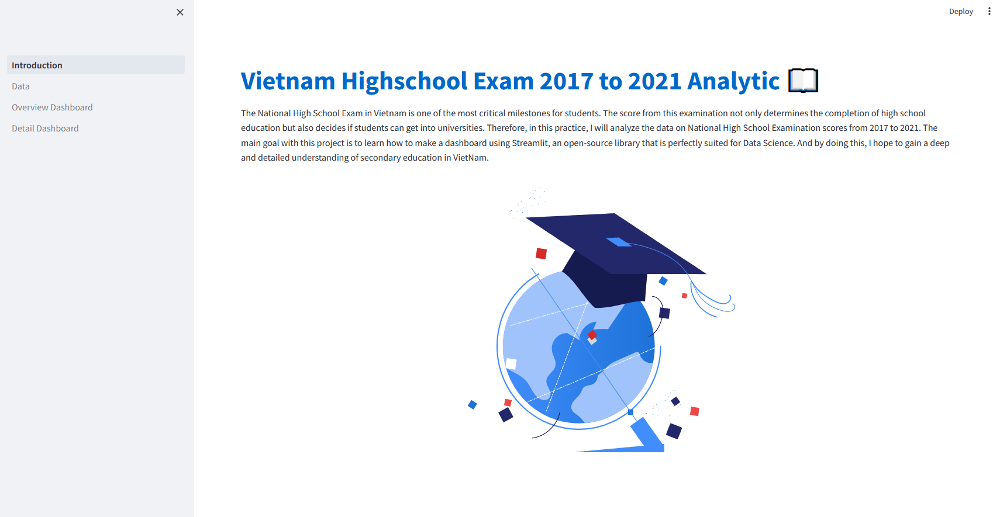
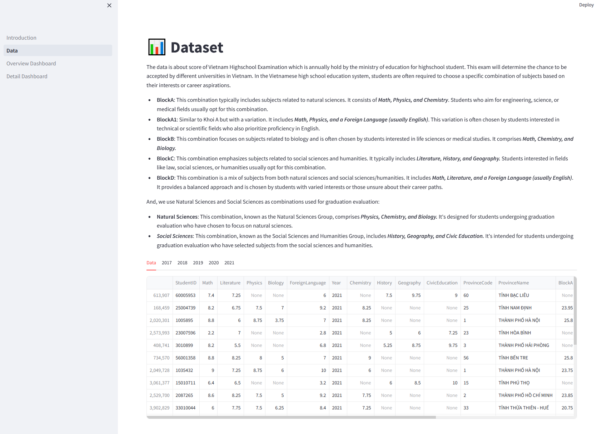
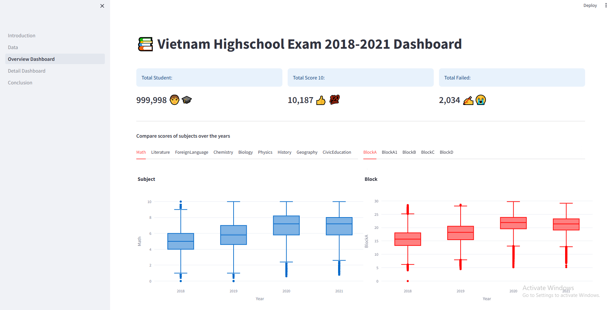
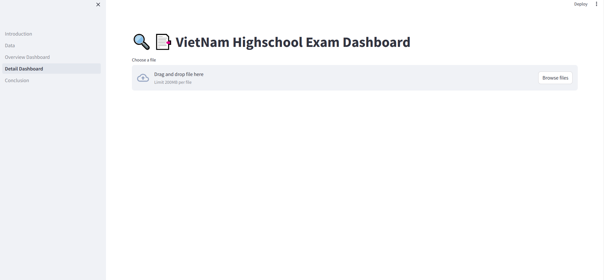
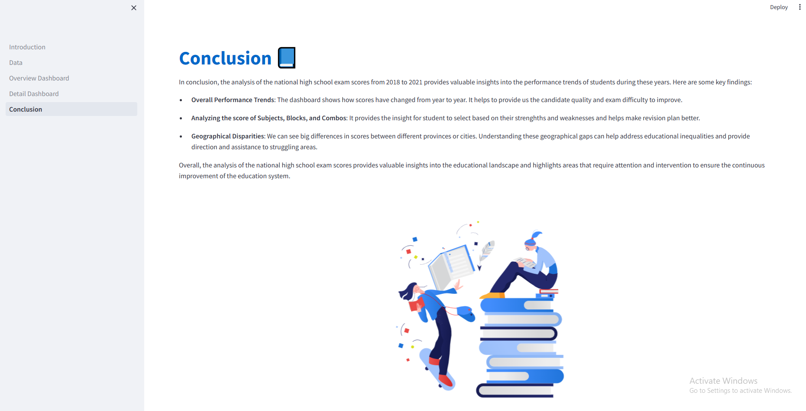

# VietNam Highshool Exam
## Overview 
- In this project, i will analyze the data on National High School Examination scores from 2017 to 2021 to enhance my skills in data processing, applying statistical knowledge, sampling  and visualization to solve real world problems. The main goal with this project is to learn how to make a dashboard using Streamlit, an open-source library that is perfectly suited for Data Science. And by doing this, I hope to gain a deep and detailed understanding of secondary education in VietNam.
- The dataset is sourced from Kaggle:  https://www.kaggle.com/datasets/phuc16102001/vietnam-highschool-exam-2017-to-2021
- The VietNam High School Exam dashboard provides an overview and detailed infomation about the National High School Exam from 2017 to 2021. Here is dashboard public: https://app-vietnam-highschool-exam.streamlit.app/

## Team Size
- 1 Data Analyst

***Start date:*** 11/03/2024

***Timeline:*** 10 days

***Actual:*** 12 days

***Target:***
- To learn and practice how to make a dashboard using Streamlit.
- Enhancing experience in working with big data.
- Improving the skills in data processing, applying statistical knowledge, samping and visualization to solve the real-world problems.

## Technical Stack:
- Python
- Streamlit
- Pandas
- Mathplots

## How to run application

To manually create a virtualenv on MacOS and Linux:

```
$ python -m venv .venv
```

After the init process completes and the virtualenv is created, you can use the following
step to activate your virtualenv.

```
$ source .venv/bin/activate
```

If you are a Windows platform, you would activate the virtualenv like this:

```
% .venv\Scripts\activate.bat
```

Once the virtualenv is activated, you can install the required dependencies.

```
$ pip install -r requirements.txt
```

At this point you can now run the application with th streamlit command

```
$ streamlit run introduction.py
```

## Screenshots

### Home page



### Dataset page



### Overview page



### Detail page



### Conclution page


